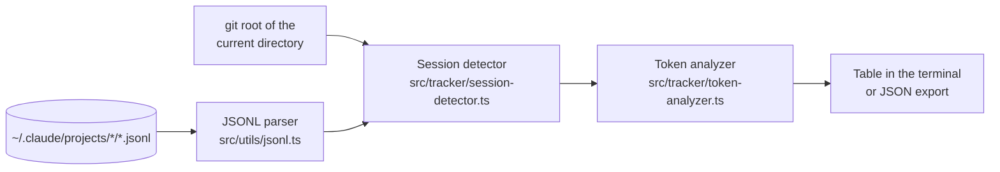

# cc-aqt-master

A command-line tool that reads your local Claude Code session logs and shows token use and an estimated cost per session.

[](LICENSE)
[](package.json)

## Why

Claude Code writes every session to JSONL files under `~/.claude/projects/`, but it does not give you a per-session overview of how many tokens went in and out. `aqt track` reads those files and prints a small table per project: input, output and cache tokens, a cache hit ratio, a rough cost estimate and the message count. It only reads local files and sends nothing anywhere.

## Quick start

Needs Node 20 or newer.

```bash
git clone https://github.com/mrsarac/cc-aqt-master.git
cd cc-aqt-master
npm install
npm run build
node dist/index.js track      # sessions of the git project in the current directory
```

`aqt track` finds the project from the git root of the current directory. Run it inside a repository you have used with Claude Code, or pass `--project <name>`.

To get an `aqt` command on your PATH, run `npm link` after the build.

## Usage

### Track token usage

```bash
aqt track                 # current project, last 5 sessions
aqt track -n 10           # last 10 sessions
aqt track -p myproject    # a specific project by name
aqt track -l              # list all Claude Code projects
aqt track -w              # watch mode (live updates)
aqt track -e usage.json   # export usage data to JSON
```

| Column | Meaning |
|--------|---------|
| Input | Input tokens sent to the model |
| Output | Output tokens returned by the model |
| Cache | Cache hit ratio: cache-read tokens / (input + cache-read tokens) |
| Cost | Estimated USD cost (see limits below) |
| Msgs | Number of messages in the session |

### Set up a config file

```bash
aqt init       # interactive setup
aqt init -y    # write defaults without prompts
aqt init -f    # overwrite an existing config
```

`aqt init` writes `.aqtrc.json` and `aqt.agents.json` to the current directory and creates or updates its `.gitignore`.

### Show the configuration

```bash
aqt config
aqt config --json
```

## Configuration

Config is loaded with [cosmiconfig](https://github.com/cosmiconfig/cosmiconfig) from the first of: `package.json` (`aqt` key), `.aqtrc`, `.aqtrc.json`, `.aqtrc.yaml`, `.aqtrc.yml`, `.aqtrc.js`, `.aqtrc.cjs`, `aqt.config.js`, `aqt.config.cjs`. Any file can also be passed with `-c, --config <path>`.

Defaults:

```json
{
  "autoSieve": true,
  "logLevel": "info",
  "defaultAgent": "master-architect",
  "claudeHome": "~/.claude",
  "tokenAlerts": {
    "sessionWarning": 150000,
    "sessionCritical": 180000
  }
}
```

`claudeHome` is the only setting `aqt track` currently uses. The others are read and shown by `aqt config` but are meant for the unfinished commands below.

## How it works



| Path | What it is |
|---|---|
| `src/index.ts` | CLI entry point (Commander) |
| `src/commands/` | `init` and `track` |
| `src/config/` | cosmiconfig loader and zod schema |
| `src/tracker/` | Session detection and token totals |
| `src/utils/` | JSONL streaming parser, Claude path helpers |
| `prompts/` | The "Master Prompt Sieve" prompt templates (text only, not wired into the CLI) |
| `docs/` | Early architecture notes and product requirements |
| `tests/` | Vitest suite |

## Development

```bash
npm test               # vitest (watch mode); use `npx vitest run` for a single run
npm run build          # esbuild bundle to dist/index.js
npm run dev            # tsx watch
npm run typecheck      # tsc --noEmit (currently reports errors, see below)
```

CI builds the project and runs the test suite on Node 22 for every push to `main` and every pull request.

## Status / limits

Prototype, version `0.1.0-alpha`, not actively maintained. Last checked on 2026-10-07 on Node 22: `npm run build` succeeds, `npx vitest run` passes 158 tests, and `aqt track` reads current Claude Code session logs.

- The cost figure uses fixed 2024 Claude 3.5 Sonnet prices ($3 input, $15 output, $0.30 cache read per million tokens), whatever model was actually used. Treat it as a rough estimate only.
- `aqt track -l` lists projects but shows 0 sessions for each.
- `npm run typecheck` reports unused-import errors. The build does not run it.
- `aqt sieve`, `aqt agents` and `aqt dashboard` are stubs: they print the current config and a TODO line. The prompt templates for the planned sieve are in `prompts/`.
- Not published to npm.

## License

[MIT](LICENSE), Copyright (c) 2026 NeuraByte Labs.
